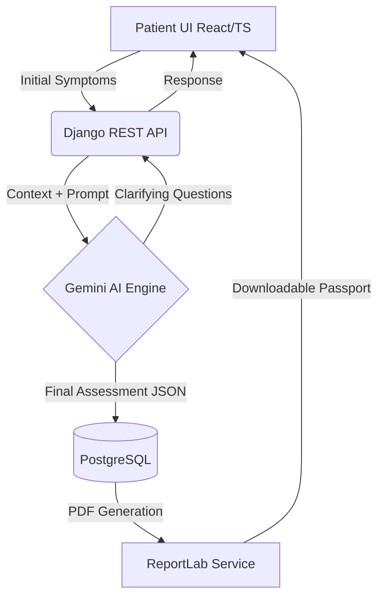

# 🏥 MedAid - **An AI Powered Medical Triage Platform**

## 🛑 Problem Statement (Why this exists)
In modern healthcare systems, the initial patient triage process is often inefficient, leading to critical bottlenecks. 
- **Patients** face long wait times, anxiety regarding their symptoms, and a lack of immediate, reliable guidance.
- **Clinicians and Hospitals** are overwhelmed by unprioritized patient intake, resulting in fatigue and potential misallocation of resources where high-risk patients aren't identified quickly enough.
- **Systematic Friction:** Traditional intake forms fail to capture nuanced medical history dynamically, leaving doctors without comprehensive context before the consultation even begins.

## 💡 Solution Overview
**MedAid** bridges the gap between patient uncertainty and clinical care by providing an intelligent, agent-driven preliminary assessment tool. 

At its core, it leverages **Large Language Models (Google Gemini)** in a carefully orchestrated pipeline to perform dynamic symptom extraction and risk stratification. Unlike static symptom checkers, MedAid conducts a reactive, multi-turn consultation—asking clarifying questions based on previous answers, generating personalized dietary/health recommendations, and producing a structured clinical report.

**Key Idea:** An LLM-powered Multi-Step Triage Agent equipped with an automated Clinical Report Generation Pipeline for quick and accurate assessment.

## ✨ Features (Core Capabilities)
- **🧠 AI-Powered Triage Engine:** Dynamic, multi-step symptom assessment via Gemini AI.
- **🛡️ Risk Stratification:** Automatically categorizes patient risk signals (Emergency, High, Medium, Low) for immediate awareness.
- **📝 Contextual Medical Profiles:** Tracks 15+ complex medical conditions and integrates them seamlessly into AI reasoning.
- **📄 Automated Health Reports:** On-the-fly PDF generation containing standardized patient intake data and AI analysis.
- **🥗 Actionable Health Insights:** Condition-specific personalized dietary and lifestyle recommendations.
- **🏥 Geo-Location Integration:** Find nearby healthcare facilities for urgent care.

## 🏗️ Architecture / How It Works

### Flow of System
1. **Patient Intake:** User authenticates and enters initial symptoms via the React frontend.
2. **Dynamic Consultation:** The Frontend queries the Django API, which orchestrates prompt chains using the Gemini API. The AI engine decides whether to ask clarifying questions or conclude the assessment.
3. **Data Normalization:** The backend formats AI outputs into structured JSON containing possible conditions, severity, and recommendations.
4. **Storage & Trigger:** Results are committed to PostgreSQL. A risk profile is generated.
5. **Final Output:** A comprehensive PDF Health Passport is produced, summarizing the symptoms, severity, and AI analysis for the patient to share with their healthcare provider.

### System Diagram


## 🛠️ Tech Stack
- **Frontend:** React 19, TypeScript, Tailwind CSS, Framer Motion, Lenis (Smooth Scrolling), React Router v7, Axios, Lucide React
- **Backend Framework:** Django 5.2, Django REST Framework (DRF)
- **Database:** PostgreSQL
- **AI & Integrations:** Google Gemini API (`google-genai`)
- **Authentication:** JWT (JSON Web Tokens) via SimpleJWT
- **Utilities:** ReportLab (Automated PDF Generation), django-cors-headers

## 📦 Installation & Setup

**Prerequisites:** Python 3.10+, Node.js 16+, and a Gemini API key.

1. **Clone the repository:**
```bash
git clone https://github.com/yourusername/medaid.git
cd medaid
```

2. **Environment Variables (.env Setup):**
You must configure your API keys for the AI engine to function correctly. 

- **Create the file:** Navigate to the `backend/medaid` directory and create a new file named exactly `.env`.
- **Get a Gemini API Key:**
  1. Go to [Google AI Studio](https://aistudio.google.com/).
  2. Sign in with your Google account.
  3. Click "Get API key" and create a new key.
- **Configure the file:** Open the `.env` file and add the following lines (replace the placeholder with your actual key):
```env
GOOGLE_API_KEY=your_gemini_api_key_here

# (Optional) If using a customized local PostgreSQL setup:
# DB_NAME=medaid
# DB_USER=postgres
# DB_PASSWORD=your_password
# DB_HOST=localhost
# DB_PORT=5432
```

3. **Backend Setup:**
```bash
cd backend
python -m venv venv
source venv/bin/activate  # Or venv\Scripts\activate on Windows
pip install -r requirements.txt
cd medaid
python manage.py migrate
python manage.py runserver
```

4. **Frontend Setup:**
```bash
# In a new terminal window
cd frontend
npm install
npm start
```
The application will be available at `http://localhost:3000` and the API at `http://127.0.0.1:8000`.

*(Alternatively, you can use the `start-medaid.sh` / `start-medaid.ps1` scripts for one-click startup)*

## 📖 Usage

### Example Patient Flow:
1. **Input:** Describe your symptoms in the prompt box: 
   > *"I've had a severe persistent headache for 3 days, accompanied by minor nausea and sensitivity to light."*
2. **Interaction:** Respond to the AI's follow-up questions dynamically determining the exact onset time and intensity.
3. **Output:** Once complete, download your structured PDF Health Passport.
