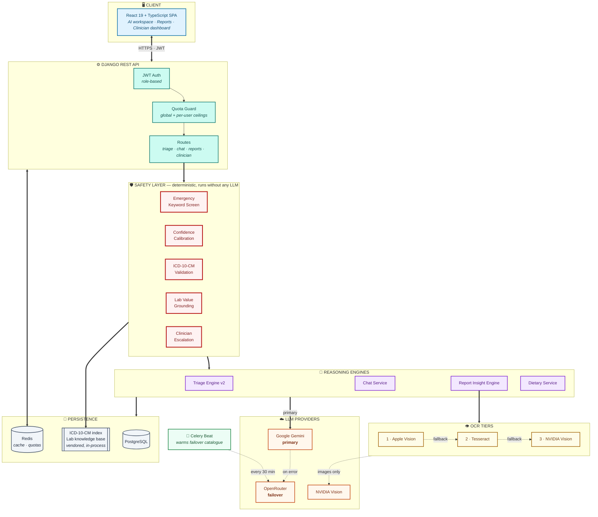
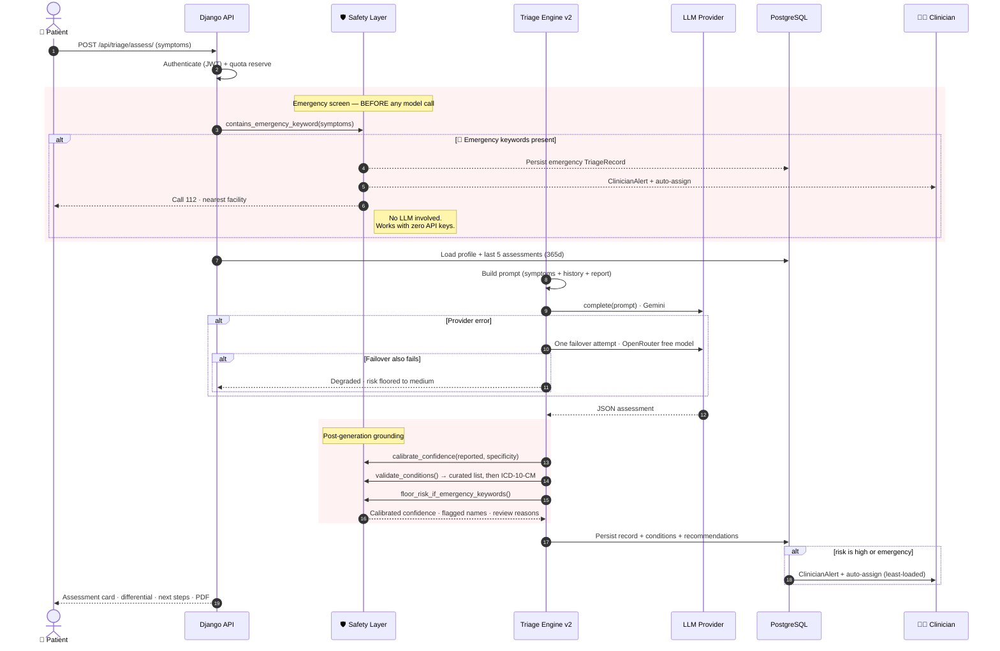
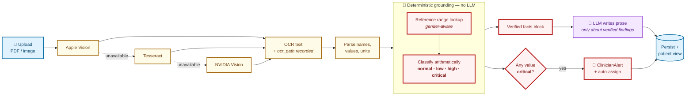
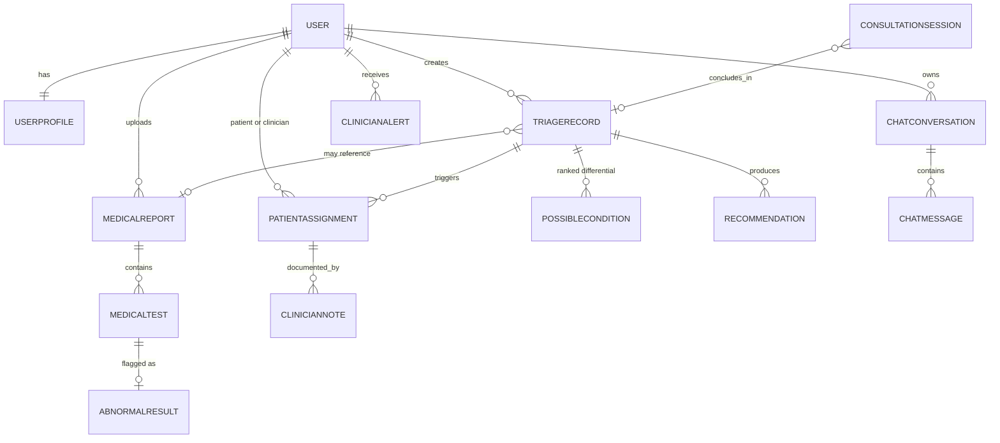

<div align="center">

# MedAid

**A safety-first AI triage platform that turns a patient's description of their symptoms into a structured, risk-stratified assessment a clinician can act on.**

[](https://github.com/janhvisaste/Medaid/actions/workflows/ci.yml)
[](LICENSE)
[](https://www.python.org/)
[](https://www.djangoproject.com/)
[](https://react.dev/)
[](#testing)
[](https://ieeexplore.ieee.org/document/11323835)

Published at **IEEE ICTBIG 2025** · [Read the paper](https://ieeexplore.ieee.org/document/11323835) · [Cite](#citation)

</div>

> [!WARNING]
> **MedAid is a research prototype, not a medical device.** It has not been clinically validated or reviewed by any regulatory body. Its output is preliminary guidance only and never a substitute for professional diagnosis. In an emergency, contact your local emergency services.

---

## Overview

A patient describes their symptoms in plain language. MedAid returns a risk tier, a ranked differential with calibrated confidence, concrete next steps, and — when the risk is high — a route to the nearest facility plus an alert to a clinician.

The problem it addresses: in under-resourced settings the first triage decision is made by the patient, with no information. They delay care that's needed and seek emergency care that isn't, clinicians receive unprioritised intake, and existing AI symptom checkers fail unsafely — presenting hallucinated conditions with confident percentages, then breaking entirely when their API provider does.

**The design premise is that the language model is the least trustworthy component in the system, so it is given the smallest possible amount of authority.** Emergency detection runs before any model call. Lab values are classified arithmetically, not by a model. Confidence is capped against how much the patient actually said. Condition names are checked against ICD-10-CM. Every one of those layers still works when every LLM provider is down.

### Demo

_Live demo and walkthrough video coming soon._

<!-- Screenshots: add images to a docs/ folder and reference them here
     with standard markdown image syntax. -->

| Landing | AI workspace | Assessment card | Clinician dashboard |
| --- | --- | --- | --- |
| _coming soon_ | _coming soon_ | _coming soon_ | _coming soon_ |

---

## Features

| | Feature | Description |
| :---: | --- | --- |
| 🩺 | **Multi-stage triage** | Free-text symptoms → risk tier, ranked differential with probabilities, reasoning, next steps, and when-to-seek-care guidance |
| 🚨 | **Pre-LLM emergency screen** | Negation-aware keyword screen runs *before* any model call and short-circuits to emergency routing. Works with zero API keys |
| 🎯 | **Confidence calibration** | The model's self-reported confidence is capped against a specificity score from the patient's actual input. "I feel bad" cannot yield 90% confidence |
| 📖 | **ICD-10-CM validation** | Condition names checked against a curated list, then a vendored ICD-10-CM index — in-process, no network call. Unrecognised names are flagged, never silently dropped |
| 🔁 | **Cross-provider failover** | Gemini primary, OpenRouter failover from the live free-model catalogue, pre-warmed so failover adds no latency to a live request |
| 📈 | **Longitudinal context** | Each assessment carries the patient's last 5 assessments within a 365-day window, bounded so history can't crowd out current symptoms |
| 📄 | **3-tier OCR** | Apple Vision (macOS sidecar) → Tesseract → NVIDIA vision. Each tier records which path served |
| 🧪 | **Deterministic lab grounding** | Reference ranges and normal/low/high/critical classification come from a knowledge base and arithmetic — never the LLM |
| 👩‍⚕️ | **Clinician escalation** | High-risk assessments and critical lab values auto-create an alert and auto-assign the least-loaded clinician |
| 💬 | **Chat workspace** | Conversational triage with clarifying questions, attachments, voice input, and per-turn assessment cards |
| 📥 | **PDF health passport** | Downloadable assessment reports to hand to a doctor |
| ⏱️ | **LLM quota guards** | Reserve-then-check counters with global and per-user ceilings on every LLM call site |

Also: condition-aware dietary guidance, risk-weighted facility lookup with maps, and a token-driven design system with WCAG-AA risk colours, light/dark themes, and reduced-motion support.

---

## Tech Stack

| Layer | Technologies |
| --- | --- |
| **Frontend** | React 19 · TypeScript 5.9 · Tailwind CSS 3 · React Router 7 · Framer Motion · Leaflet |
| **Backend** | Python 3.12 · Django 4.2 · DRF 3.16 · SimpleJWT · Celery 5.6 (+ beat) · django-redis |
| **Database** | PostgreSQL (production) · SQLite (development) — selected by `DB_ENGINE`, which has no default |
| **AI/LLM** | Google Gemini (primary) · OpenRouter (failover) · NVIDIA vision (report images) |
| **OCR** | Apple Vision via PyObjC · Tesseract · PyMuPDF · OpenCV |
| **Medical data** | Vendored ICD-10-CM tabular list (CMS/NCHS, public domain) · lab reference knowledge base |
| **Infrastructure** | Redis (cache + Celery broker + cross-worker quotas) · ReportLab · GitHub Actions |

---

## Architecture


```mermaid
flowchart TB
    subgraph client["🖥️  CLIENT"]
        UI["React 19 + TypeScript SPA<br/><i>AI workspace · Reports · Clinician dashboard</i>"]
    end

    subgraph api["⚙️  DJANGO REST API"]
        direction TB
        AUTH["JWT Auth<br/><i>role-based</i>"]
        QUOTA["Quota Guard<br/><i>global + per-user ceilings</i>"]
        ROUTES["Routes<br/><i>triage · chat · reports · clinician</i>"]
        AUTH --> QUOTA --> ROUTES
    end

    subgraph safety["🛡️  SAFETY LAYER — deterministic, runs without any LLM"]
        direction LR
        EMERG["Emergency<br/>Keyword Screen"]
        CALIB["Confidence<br/>Calibration"]
        ICD["ICD-10-CM<br/>Validation"]
        LABS["Lab Value<br/>Grounding"]
        ALERTS["Clinician<br/>Escalation"]
    end

    subgraph engines["🧠  REASONING ENGINES"]
        direction TB
        TRIAGE["Triage Engine v2"]
        CHAT["Chat Service"]
        REPORT["Report Insight Engine"]
        DIET["Dietary Service"]
    end

    subgraph providers["☁️  LLM PROVIDERS"]
        direction LR
        GEM["Google Gemini<br/><b>primary</b>"]
        OR["OpenRouter<br/><b>failover</b>"]
        NV["NVIDIA Vision"]
    end

    subgraph ocr["👁️  OCR TIERS"]
        direction LR
        T1["1 · Apple Vision"]
        T2["2 · Tesseract"]
        T3["3 · NVIDIA Vision"]
        T1 -.fallback.-> T2 -.fallback.-> T3
    end

    subgraph data["💾  PERSISTENCE"]
        direction LR
        PG[("PostgreSQL")]
        RD[("Redis<br/><i>cache · quotas</i>")]
        KB[["ICD-10-CM index<br/>Lab knowledge base<br/><i>vendored, in-process</i>"]]
    end

    CEL["🔄 Celery Beat<br/><i>warms failover catalogue</i>"]

    UI <==>|"HTTPS · JWT"| api
    ROUTES ==> safety
    safety ==> engines
    engines ==>|"primary"| GEM
    GEM -.->|"on error"| OR
    REPORT ==> ocr
    ocr -.->|"images only"| NV
    engines ==> data
    safety ==> KB
    CEL -.->|"every 30 min"| OR
    api <==> RD

    classDef clientStyle fill:#e0f2fe,stroke:#0369a1,stroke-width:2px,color:#0c4a6e
    classDef apiStyle fill:#ccfbf1,stroke:#0f766e,stroke-width:2px,color:#134e4a
    classDef safetyStyle fill:#fef2f2,stroke:#b91c1c,stroke-width:3px,color:#7f1d1d
    classDef engineStyle fill:#f3e8ff,stroke:#7e22ce,stroke-width:2px,color:#581c87
    classDef providerStyle fill:#fff7ed,stroke:#c2410c,stroke-width:2px,color:#7c2d12
    classDef ocrStyle fill:#fefce8,stroke:#a16207,stroke-width:2px,color:#713f12
    classDef dataStyle fill:#f1f5f9,stroke:#475569,stroke-width:2px,color:#1e293b
    classDef workerStyle fill:#ecfdf5,stroke:#15803d,stroke-width:2px,color:#14532d

    class UI clientStyle
    class AUTH,QUOTA,ROUTES apiStyle
    class EMERG,CALIB,ICD,LABS,ALERTS safetyStyle
    class TRIAGE,CHAT,REPORT,DIET engineStyle
    class GEM,OR,NV providerStyle
    class T1,T2,T3 ocrStyle
    class PG,RD,KB dataStyle
    class CEL workerStyle
```

**The load-bearing idea:** the safety layer sits *between* the API and the reasoning engines, not after them. Every request passes through it on the way in and on the way out, and every check in it is deterministic — so the system's floor is set by code, not by whether a model responded.

### How a triage request flows


```mermaid
sequenceDiagram
    autonumber
    actor P as 👤 Patient
    participant API as Django API
    participant S as 🛡️ Safety Layer
    participant E as Triage Engine v2
    participant L as LLM Provider
    participant DB as PostgreSQL
    participant C as 👩‍⚕️ Clinician

    P->>API: POST /api/triage/assess/ (symptoms)
    API->>API: Authenticate (JWT) + quota reserve

    rect rgb(254, 242, 242)
        Note over S: Emergency screen — BEFORE any model call
        API->>S: contains_emergency_keyword(symptoms)
        alt 🚨 Emergency keywords present
            S-->>DB: Persist emergency TriageRecord
            S-->>C: ClinicianAlert + auto-assign
            S-->>P: Call 112 · nearest facility
            Note right of S: No LLM involved.<br/>Works with zero API keys.
        end
    end

    API->>DB: Load profile + last 5 assessments (365d)
    E->>E: Build prompt (symptoms + history + report)
    E->>L: complete(prompt) · Gemini
    alt Provider error
        E->>L: One failover attempt · OpenRouter free model
        alt Failover also fails
            E-->>API: Degraded · risk floored to medium
        end
    end
    L-->>E: JSON assessment

    rect rgb(254, 242, 242)
        Note over S: Post-generation grounding
        E->>S: calibrate_confidence(reported, specificity)
        E->>S: validate_conditions() → curated list, then ICD-10-CM
        E->>S: floor_risk_if_emergency_keywords()
        S-->>E: Calibrated confidence · flagged names · review reasons
    end

    E->>DB: Persist record + conditions + recommendations
    alt risk is high or emergency
        DB->>C: ClinicianAlert + auto-assign (least-loaded)
    end
    API-->>P: Assessment card · differential · next steps · PDF
```

### Report analysis


```mermaid
flowchart LR
    U["📎 Upload<br/>PDF / image"] --> AV["Apple Vision"]
    AV -.unavailable.-> TS["Tesseract"]
    TS -.unavailable.-> NV["NVIDIA Vision"]
    AV & TS & NV --> TXT["OCR text<br/><i>+ ocr_path recorded</i>"]
    TXT --> PARSE["Parse names,<br/>values, units"]
    PARSE --> GROUND

    subgraph GROUND["🔬 Deterministic grounding — no LLM"]
        direction TB
        REF["Reference range lookup<br/><i>gender-aware</i>"] --> CLS["Classify arithmetically<br/><b>normal · low · high · critical</b>"]
    end

    GROUND --> FACTS["Verified facts block"] --> LLM["🧠 LLM writes prose<br/><i>only about verified findings</i>"]
    LLM --> STORE[("Persist +<br/>patient view")]
    GROUND --> CRIT{"Any value<br/><b>critical</b>?"}
    CRIT -->|yes| ESC["🚨 ClinicianAlert<br/>+ auto-assign"] --> STORE

    classDef io fill:#e0f2fe,stroke:#0369a1,stroke-width:2px,color:#0c4a6e
    classDef ocrS fill:#fefce8,stroke:#a16207,stroke-width:2px,color:#713f12
    classDef gr fill:#fef2f2,stroke:#b91c1c,stroke-width:3px,color:#7f1d1d
    classDef llmS fill:#f3e8ff,stroke:#7e22ce,stroke-width:2px,color:#581c87
    class U io
    class AV,TS,NV,TXT,PARSE ocrS
    class REF,CLS,FACTS,CRIT,ESC gr
    class LLM llmS
    class STORE io
```

> **Why the split:** the [Lab-AI study](https://arxiv.org/abs/2409.18986) measured unaugmented LLMs answering lab reference-range questions at **38.4% accuracy**, rising to **99.3%** when grounded in source data. Deciding whether a value is high or low is therefore the least reliable thing to ask a model — and the most safety-critical field the system produces. So arithmetic decides the classification, and the model only writes prose about findings already verified. See [`api/lab_reference.py`](backend/api/lab_reference.py).

### Data model


```mermaid
erDiagram
    USER ||--|| USERPROFILE : has
    USER ||--o{ TRIAGERECORD : creates
    USER ||--o{ MEDICALREPORT : uploads
    USER ||--o{ CHATCONVERSATION : owns
    USER ||--o{ PATIENTASSIGNMENT : "patient or clinician"
    USER ||--o{ CLINICIANALERT : receives
    TRIAGERECORD ||--o{ POSSIBLECONDITION : "ranked differential"
    TRIAGERECORD ||--o{ RECOMMENDATION : produces
    TRIAGERECORD ||--o{ PATIENTASSIGNMENT : triggers
    TRIAGERECORD }o--o| MEDICALREPORT : "may reference"
    MEDICALREPORT ||--o{ MEDICALTEST : contains
    MEDICALTEST ||--o| ABNORMALRESULT : "flagged as"
    PATIENTASSIGNMENT ||--o{ CLINICIANNOTE : documented_by
    CHATCONVERSATION ||--o{ CHATMESSAGE : contains
    CONSULTATIONSESSION }o--o| TRIAGERECORD : concludes_in
```

`TriageRecord` is the centre of the schema: it carries `risk_level`, calibrated `confidence`, `reasoning`, `assessment_source` (`ai_v2` / `emergency_rule` / `safety_rule`) and `requires_human_review`. Full definitions in [`api/models.py`](backend/api/models.py).

---

## Safety & Guardrails

This is the part of the system that matters most. Each layer is independent, and **each works with zero API keys configured.**

1. **Pre-LLM emergency screen** — [`api/safety/emergency_check.py`](backend/api/safety/emergency_check.py) is the single source of truth, called from every symptom entry point (direct triage, wizard, chat, engine), so routing is identical regardless of how a patient entered. It is negation-aware: "no chest pain" does not trigger the chest-pain rule.
2. **Input specificity gate** — sparse input produces clarifying questions, not a low-evidence guess. The gate fires once per conversation so nobody is interrogated in a loop.
3. **Confidence calibration** — a 12-word description caps confidence regardless of what the model claimed. The API returns `reported_confidence`, `confidence_was_capped`, and `confidence_explanation` so the UI can *explain* uncertainty instead of showing a bare number.
4. **Condition validation** — curated list first, then ICD-10-CM. Unrecognised names are flagged as unverified, never presented with the authority of a validated term and never silently dropped.
5. **Risk floor** — model risk is raised to `high` when emergency keywords are present, and degraded responses are never below `medium`. The floor only ever moves up.
6. **Deterministic critical-value escalation** — classification comes from arithmetic against the knowledge base, so a critically low haemoglobin reaches a clinician even if the model's prose downplays it.
7. **No PHI in logs** — structured, event-keyed logging with IDs only (`triage.assessment_complete`, `report.ocr_served`). Never symptom text, patient names, or report contents.

The parity endpoint `/api/reference-compat/assess/` deliberately *lacks* all of the above; it exists for behavioural comparison against a reference implementation. It is off by default, logs a warning when enabled, and must never serve real patients.

**Honest limitation:** critical-value coverage is bounded by the knowledge base. An analyte with no reference data classifies as `unknown`, never `critical` — a missed critical value remains possible. This raises the floor substantially; it is not a complete safety net.

---

## Quick Start

**Prerequisites:** Python 3.12+, Node 18+. PostgreSQL, Redis, and Tesseract are optional locally. You'll want a [Gemini API key](https://aistudio.google.com/) (free tier works); everything else degrades gracefully without keys.

```bash
git clone https://github.com/janhvisaste/Medaid.git
cd Medaid

# Backend
python3 -m venv .venv && source .venv/bin/activate     # Windows: .venv\Scripts\activate
pip install -r backend/requirements.txt
cp backend/.env.example backend/.env      # add your GOOGLE_API_KEY
cd backend && python manage.py migrate && python manage.py runserver 8001

# Frontend (new terminal)
cd frontend && cp .env.example .env.local
npm install --legacy-peer-deps && npm start
```

Frontend at **localhost:3000**, API at **127.0.0.1:8001/api**. Or run `./start-medaid.sh` (`.\start-medaid.ps1` on Windows) for both.

Optional services: `celery -A medaid worker -l info`, `celery -A medaid beat -l info` (warms the failover catalogue), and `cd ocr-service && python ocr_server.py` (Apple Vision OCR, macOS only).

### Configuration

Every variable is documented inline in [`backend/.env.example`](backend/.env.example) — **including which ones fail silently when unset**, flagged `SILENT NO-OP`. The ones that matter most:

| Variable | Effect when unset |
| --- | --- |
| `DB_ENGINE` | **Startup error.** No default by design — it used to fall back to SQLite silently and hide misconfigured Postgres deployments |
| `DJANGO_SECRET_KEY` | **Startup fails** if `DJANGO_DEBUG=False` and it's still the dev placeholder |
| `GOOGLE_API_KEY` | 🔇 Triage falls back to OpenRouter or a degraded response; chat and insights lose AI output |
| `OPENROUTER_API_KEY` | 🔇 No cross-provider failover; the model selector offers nothing |
| `GOOGLE_PLACES_API_KEY` | 🔇 Facility lookups return **no results** — panels come up empty, no error |
| `REDIS_URL` | 🔇 Quotas enforced **per process** — with N workers every ceiling is multiplied by N. Required for multi-worker deployments |
| `CORS_ALLOWED_ORIGINS` | Empty by default in production, so the browser blocks all API calls until set |
| `ENABLE_REFERENCE_COMPAT_API` | Defaults `false`. Keep it false — see [Safety](#safety--guardrails) |

---

## Project Structure

```
backend/
├── manage.py
├── requirements.txt
├── medaid/                     # settings · urls · celery
├── reference_compat/           # gated parity endpoint (off by default)
└── api/
    ├── models.py               # 13 models: users, triage, reports, clinician
    ├── views.py                # REST endpoints
    ├── triage_engine_v2.py     # multi-stage assessment + provider failover
    ├── chat_service.py         # conversational triage
    ├── report_processor.py     # OCR → insight orchestration
    ├── medical_report_analyzer.py   # 3-tier OCR fallback chain
    ├── safety/                 # ⭐ emergency_check · critical_findings · clinician_alerts
    ├── assessment_quality.py   # confidence calibration + name validation
    ├── icd10.py                # ICD-10-CM index + fuzzy lookup
    ├── lab_reference.py        # deterministic lab grounding
    ├── patient_context.py      # bounded longitudinal history
    ├── llm_quota.py            # reserve-then-check quota guards
    ├── llm_providers/          # base contract · gemini · openrouter · catalog
    └── test_*.py               # 39 modules, 361 tests

frontend/src/
├── styles/medaidTokens.ts      # ⭐ single source of design truth
├── services/                   # apiService · authService
└── components/
    ├── Dashboard/              # AI workspace (chat + assessments)
    ├── Results/                # AssessmentCard · DietaryAdvice
    ├── Clinician/ Profile/ PatientHistory/ Reports/ Auth/ Layout/ ui/

ocr-service/                    # Apple Vision OCR sidecar (macOS only)
```

---

## API Reference

Base URL `http://localhost:8001/api`. All endpoints except signup/login require `Authorization: Bearer <token>`. Access tokens live 1 hour; refresh tokens 7 days with rotation.

| Group | Endpoints |
| --- | --- |
| **Auth** | `POST /auth/{signup,login,logout}/` · `POST /auth/token/refresh/` · `GET /auth/me/` |
| **Profile** | `GET/PATCH /profile/` · `POST /profile/update-history/` |
| **Triage** | `POST /triage/assess/` · `GET /triage/history/` · `DELETE /triage/<id>/` · `GET /models/available` |
| **Reports** | `GET/POST /medical-reports/` · `POST /reports/analyze/` · `POST /reports/analyze-detailed/` |
| **Chat** | `GET/POST /chat/conversations/` · `POST /chat/conversations/<id>/messages/` |
| **PDFs** | `GET /reports/download/<triage_id>/` · `GET /reports/health-passport-pdf/` |
| **Facilities / Diet** | `GET /facilities/nearby/` · `GET /recommendations/dietary/` |
| **Clinician** | `GET /clinician/{stats,patients,alerts}/` · `POST /clinician/{assign-patient,notes}/` |

<details>
<summary><b>Example — <code>POST /triage/assess/</code></b></summary>

```bash
curl -X POST http://localhost:8001/api/triage/assess/ \
  -H "Authorization: Bearer $ACCESS_TOKEN" -H "Content-Type: application/json" \
  -d '{"symptoms": "Persistent dry cough for 3 weeks, worse at night, no fever"}'
```

```jsonc
{
  "triage_id": 142,
  "risk_level": "low",
  "confidence": 0.42,
  "reasoning": "The three-week duration and nocturnal pattern are most consistent with a post-viral or upper-airway cough…",
  "possible_conditions": [
    { "disease": "Post-Viral Cough",            "confidence": 0.35, "category": "respiratory" },
    { "disease": "Upper Airway Cough Syndrome", "confidence": 0.25, "category": "respiratory" }
  ],
  "recommendations": ["Stay hydrated and use a humidifier at night", "…"],
  "when_to_seek_care": "See a doctor if you develop a fever above 38 °C, shortness of breath, or cough up blood.",

  // Calibration: what the model claimed vs. what the input supports
  "reported_confidence": 0.85,
  "confidence_was_capped": true,
  "confidence_explanation": "Confidence was reduced because the description lacks associated symptoms and prior history.",
  "missing_detail": ["associated_symptoms", "medication_history"],

  // Validation & review routing
  "has_unrecognized_conditions": false,
  "requires_human_review": false,

  // Provenance
  "model_id": "gemini-3.1-flash-lite",
  "assessment_source": "ai_v2",
  "degraded": false,
  "used_prior_assessments": 2
}
```

An emergency short-circuit returns `"assessment_source": "emergency_rule"` with `nearby_hospitals` — and no model was called. A quota ceiling returns `429`.

</details>

---

## Testing

**361 tests across 39 modules.** Every provider call is mocked, so the suite runs with no API keys — which also proves the degraded paths work without credentials.

```bash
cd backend && python manage.py test        # full suite
cd frontend && npx tsc --noEmit                   # type-check
CI=true npm run build                             # lint + build, warnings are errors
```

Coverage concentrates where risk does: safety (`test_emergency_check`, `test_critical_findings`, `test_risk_consistency`, `test_degraded_fallback`), grounding (`test_confidence_cap`, `test_icd10_validation`, `test_lab_reference`), provider failover (`test_provider_fallback`, `test_gemini_timeout`), quotas, and end-to-end flows.

CI runs the backend suite, a missing-migration check, the frontend type-check and build, and a secret scan on every push — see [`.github/workflows/ci.yml`](.github/workflows/ci.yml).

> A few LLM-quota tests key on the current minute and can be flaky on a slow machine. Re-run once before investigating.

---

## Deployment

Provision PostgreSQL, Redis, and object storage for `MEDIA_ROOT`, then:

```bash
python manage.py migrate --no-input && python manage.py collectstatic --no-input
gunicorn medaid.wsgi:application --bind 0.0.0.0:8000 --workers 4
celery -A medaid worker -l info      # plus: celery -A medaid beat -l info
cd frontend && npm ci --legacy-peer-deps && npm run build   # serve build/ from a CDN
```

Set `DJANGO_DEBUG=False` (which flips SSL redirect, HSTS, and secure cookies to their hardened defaults), a real `DJANGO_SECRET_KEY`, `DB_ENGINE=postgresql`, `REDIS_URL`, `ALLOWED_HOSTS`, and `CORS_ALLOWED_ORIGINS`. Verify `GET /` returns the health check and that no `cache.redis_unconfigured_in_production` warning appears.

The app is stateless and provider-agnostic — anything that runs a Django container works. The only macOS-bound component is the Apple Vision OCR sidecar; on Linux that tier drops out and Tesseract serves.

**Not yet provided:** Docker Compose, OpenAPI schema, and observability wiring (Sentry / OpenTelemetry / metrics).

---

## Known Limitations

Stated plainly, because a triage system that overstates itself is the failure mode that matters.

1. **Not clinically validated.** No prospective study, no regulatory review. Research prototype only.
2. **Critical-value coverage is bounded by the knowledge base** — an out-of-scope analyte never classifies as `critical`.
3. **Emergency detection is keyword-based.** Negation-aware, but a patient using words the list doesn't contain falls through to the LLM path.
4. **English only.** The keyword lists include a few transliterated Hindi terms; the system is not multilingual.
5. **The differential is a hypothesis, not a diagnosis.** Percentages are calibrated model outputs, not epidemiological priors.
6. **OCR tier 1 is macOS-only**; Linux runs on Tesseract, which is weaker on photographed reports.
7. **Quota enforcement needs Redis** — without it, ceilings are per-process.
8. **No FHIR/HL7 interoperability**, no EHR integration, and PDF generation is synchronous.

---

## Contributing

See [CONTRIBUTING.md](CONTRIBUTING.md). Branch from `main` (GitHub Flow), use [Conventional Commits](https://www.conventionalcommits.org/), and note the one hard rule: **anything touching the safety layer needs a test proving the guardrail holds when the LLM is unavailable.**

Security issues go through [SECURITY.md](SECURITY.md), not public issues.

---

## License

[MIT](LICENSE), with the medical disclaimer reproduced in the licence file. Vendored ICD-10-CM data is CMS/NCHS, US public domain.

---

## Citation

**Janhvi Saste** — [@janhvisaste](https://github.com/janhvisaste). Published with Shivani Kinagi, Sayyam Jain, Nitin Sakhare, Anuradha Yenkikar, Pranjal Pandit, and Nilesh Sable.

```bibtex
@inproceedings{kinagi2025medaid,
  title     = {Medaid: A Safety-First AI Triage System for Rural Healthcare},
  author    = {Kinagi, Shivani and Jain, Sayyam and Saste, Janhvi and
               Sakhare, Nitin and Yenkikar, Anuradha and Pandit, Pranjal and
               Sable, Nilesh},
  booktitle = {2025 IEEE 5th International Conference on ICT in Business
               Industry \& Government (ICTBIG)},
  year      = {2025},
  publisher = {IEEE},
  doi       = {10.1109/ICTBIG68706.2025.11323835},
  url       = {https://ieeexplore.ieee.org/document/11323835}
}
```

Also referenced: [Lab-AI (arXiv:2409.18986)](https://arxiv.org/abs/2409.18986), whose grounding results shaped the decision to keep lab classification out of the model.

<div align="center">
<br>

*Built on a simple premise: the language model is the least trustworthy component, so give it the least authority.*

</div>
