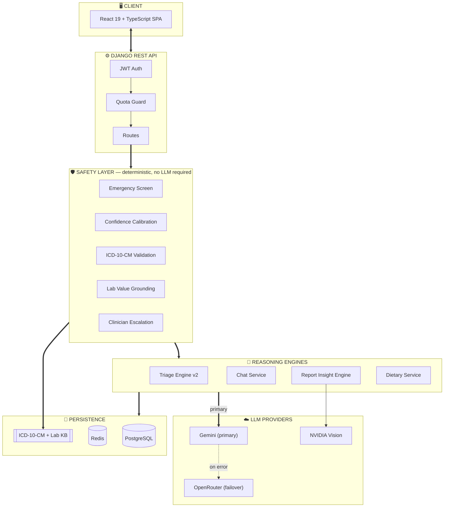

<div align="center">


# MedAid

**AI that cares. Safety that leads.**
Turns a patient's description of their symptoms into a structured, risk-stratified assessment a clinician can act on.

[](https://www.python.org/)
[](https://www.djangoproject.com/)
[](https://ieeexplore.ieee.org/document/11323835)
[](LICENSE)

</div>

> **MedAid is a research prototype, not a medical device.** It has not been clinically validated or reviewed by any regulatory body. Its output is preliminary guidance only, never a substitute for professional diagnosis. In an emergency, contact your local emergency services.

---

## 🎯 What is MedAid?

MedAid is an **LLM-driven triage assistant** built for under-resourced healthcare settings, where the first triage decision is normally made by the patient with no information at all — leading to delayed care, unnecessary ER visits, and clinicians receiving intake with no priority signal.

### The Problem

A patient describes symptoms in plain text. Somewhere between "I feel bad" and a clinician's attention, someone has to decide how urgent that is.

- LLMs alone can hallucinate a condition or overstate their own confidence
- Patients aren't equipped to self-triage
- Clinicians get no priority signal on incoming cases
- A wrong "low risk" call can cost a life; a wrong "high risk" call floods the system

### The Solution

MedAid keeps the LLM in the loop for reasoning, but never lets it be the final word:

- **Pre-LLM emergency screen** — keyword rules catch emergencies before any model call
- **Deterministic grounding** — confidence, conditions, and lab values are checked by code, not trusted from the model
- **Automatic clinician escalation** — high-risk cases route to a human, always
- **Works with zero API keys** — every safety check still runs even if the LLM is down

**The governing idea:** the LLM is the least trustworthy component in the system, so it's given the smallest possible amount of authority.

---

## ⚡ Quick Start

### Prerequisites

Python 3.12+, Node 18+. PostgreSQL, Redis, and Tesseract are optional for local dev. You'll want a [Gemini API key](https://aistudio.google.com/) (free tier works) — every other feature degrades gracefully without one.

### Installation

```bash
git clone https://github.com/janhvisaste/Medaid.git
cd Medaid
```

**Backend**

```bash
python3 -m venv .venv && source .venv/bin/activate     # Windows: .venv\Scripts\activate
pip install -r backend/requirements.txt
cp backend/.env.example backend/.env                    # add your GOOGLE_API_KEY
cd backend
python manage.py migrate
python manage.py runserver 8001
```

**Frontend** (new terminal)

```bash
cd frontend
cp .env.example .env.local
npm install --legacy-peer-deps
npm start
```

That's it. Frontend runs at **localhost:3000**, API at **127.0.0.1:8001/api**.

Or start both at once: `./start-medaid.sh` (`.\start-medaid.ps1` on Windows).

Every environment variable — including which ones fail silently when unset — is documented in [`backend/.env.example`](backend/.env.example).

---

## 🩺 How It Works

1. **Complete your profile** — pincode and medical history feed into the assessment prompt
2. **Describe your symptoms** in plain language in the AI workspace
3. **Answer clarifying questions** if your description is too sparse for a confident answer
4. **Read the assessment card** — risk badge, calibrated confidence, leading condition, next steps, and (for high/emergency risk) a **Call 112** / **Find nearest facility** banner
5. **Attach a report** (PDF or image) — OCR'd, lab values classified deterministically
6. **Download the PDF** to hand to your doctor

Clinicians get a separate dashboard: assigned patients, priority-ordered alerts, and private notes per case.

---

## 🛡️ The Safety Layer

The part of the system that matters most, in the order a request passes through it:

```
1. Emergency Screen         → negation-aware keyword match, runs before any model call
2. Input Specificity Gate   → sparse input triggers clarifying questions, not a guess
3. Confidence Calibration   → model's claimed confidence capped by how specific the input was
4. Condition Validation     → checked against curated list, then ICD-10-CM
5. Risk Floor               → emergency keywords force "high"; a degraded response never drops below "medium"
6. Critical Lab Escalation  → arithmetic classification, never the model's prose
```

**Why this matters:** the safety layer sits *between* the API and the reasoning engines, not after them — so the system's floor is set by code, not by whether a model responded. Every check above is deterministic and holds even during a full provider outage.

**Honest limitation:** critical-value coverage is bounded by the knowledge base. An analyte with no reference data classifies as `unknown`, never `critical`. This raises the floor substantially — it is not a complete safety net.

---

## 🏛️ Architecture


```mermaid
flowchart TB
    subgraph client["🖥️ CLIENT"]
        UI["React 19 + TypeScript SPA"]
    end

    subgraph api["⚙️ DJANGO REST API"]
        AUTH["JWT Auth"] --> QUOTA["Quota Guard"] --> ROUTES["Routes"]
    end

    subgraph safety["🛡️ SAFETY LAYER — deterministic, no LLM required"]
        direction LR
        EMERG["Emergency Screen"]
        CALIB["Confidence Calibration"]
        ICD["ICD-10-CM Validation"]
        LABS["Lab Value Grounding"]
        ALERTS["Clinician Escalation"]
    end

    subgraph engines["🧠 REASONING ENGINES"]
        TRIAGE["Triage Engine v2"]
        CHAT["Chat Service"]
        REPORT["Report Insight Engine"]
        DIET["Dietary Service"]
    end

    subgraph providers["☁️ LLM PROVIDERS"]
        GEM["Gemini (primary)"]
        OR["OpenRouter (failover)"]
        NV["NVIDIA Vision"]
    end

    subgraph data["💾 PERSISTENCE"]
        PG[("PostgreSQL")]
        RD[("Redis")]
        KB[["ICD-10-CM + Lab KB"]]
    end

    UI <==> api
    ROUTES ==> safety ==> engines
    engines ==>|primary| GEM
    GEM -.->|on error| OR
    REPORT --> NV
    engines ==> data
    safety ==> KB
```

**Failover:** exactly one cross-provider attempt against OpenRouter, resolved from a catalogue refreshed every 30 minutes by a Celery beat job — so discovering a fallback model costs no extra latency on the request path.

**Not a RAG pipeline.** Lab classification is exact-match and arithmetic, not vector similarity — a reference range is a fact to look up, not a nearest neighbour to approximate.

---

## 🧰 Tech Stack

| Layer | Technologies |
|---|---|
| **Frontend** | React 19, TypeScript, Tailwind CSS, React Router, Framer Motion, Leaflet |
| **Backend** | Django 4.2, DRF, SimpleJWT, Celery + beat, django-redis |
| **Database** | PostgreSQL (prod) / SQLite (dev) |
| **AI/LLM** | Google Gemini (primary), OpenRouter (failover), NVIDIA Vision (report images) |
| **OCR** | Apple Vision (macOS) → Tesseract → NVIDIA Vision |
| **Medical data** | Vendored ICD-10-CM (CMS/NCHS, public domain), lab reference KB |
| **Infra** | Redis, ReportLab, GitHub Actions |

---

## 📡 API Reference

| Method | Path | Purpose |
|---|---|---|
| `POST` | `/api/auth/signup/`, `/api/auth/login/` | Register / authenticate (JWT) |
| `POST` | `/api/triage/assess/` | Run a full triage assessment |
| `GET` | `/api/triage/history/` | Assessment history |
| `GET` | `/api/models/available` | Allow-listed selectable models |
| `POST` | `/api/reports/analyze/` | OCR + structure an uploaded medical report |
| `POST` | `/api/chat/conversations/<id>/messages/` | Send a chat turn (multipart for attachments) |
| `GET` | `/api/facilities/nearby/` | Risk-weighted nearby-facility search |
| `GET` | `/api/recommendations/dietary/` | Condition-aware dietary advice |
| `GET` | `/api/reports/download/<triage_id>/` | Assessment PDF |
| `GET` | `/api/clinician/{stats,patients,alerts}/` | Clinician dashboard data |

<details>
<summary><b>Example — <code>POST /api/triage/assess/</code></b></summary>

```jsonc
{
  "risk_level": "low",
  "confidence": 0.42,                 // calibrated
  "reported_confidence": 0.85,        // what the model claimed
  "confidence_was_capped": true,
  "possible_conditions": [
    { "disease": "Post-Viral Cough", "confidence": 0.35 }
  ],
  "recommendations": ["Stay hydrated and use a humidifier at night"],
  "requires_human_review": false,
  "assessment_source": "ai_v2"
}
```

An emergency short-circuit returns `"assessment_source": "emergency_rule"` and never calls a model.

</details>

---

## 📁 Project Structure

```
backend/
├── manage.py, requirements.txt
├── medaid/                     settings, urls, celery
└── api/
    ├── models.py                13 models: users, triage, reports, clinician
    ├── views.py                 REST endpoints
    ├── triage_engine_v2.py      multi-stage assessment + provider failover
    ├── chat_service.py          conversational triage
    ├── report_processor.py      OCR → insight orchestration
    ├── safety/                  emergency_check, critical_findings, clinician_alerts
    ├── assessment_quality.py    confidence calibration + name validation
    ├── icd10.py, lab_reference.py  deterministic grounding
    ├── llm_providers/           gemini, openrouter, catalog
    └── test_*.py                33 modules, 343 tests

frontend/src/
├── styles/medaidTokens.ts       single source of design truth
├── services/                    apiService, authService
└── components/
    ├── Dashboard/                AI workspace (chat + assessments)
    ├── Results/                  AssessmentCard, DietaryAdvice
    └── Clinician/ Profile/ PatientHistory/ Reports/ Auth/ Layout/ ui/

ocr-service/                     Apple Vision OCR sidecar (macOS only)
```

---

## 🧪 Testing

343 tests, every provider call mocked — the suite runs with **no API keys**, which also proves the degraded paths work without credentials.

```bash
cd backend && python manage.py test         # full suite
cd frontend && CI=true npm run build        # type-check + lint + build
```

Coverage concentrates on risk: `test_emergency_check`, `test_critical_findings`, `test_confidence_cap`, `test_icd10_validation`, `test_provider_fallback`, plus end-to-end flow tests.

---

## 🚀 Deployment

```bash
python manage.py migrate --no-input && python manage.py collectstatic --no-input
gunicorn medaid.wsgi:application --bind 0.0.0.0:8000 --workers 4
celery -A medaid worker -l info          # plus: celery -A medaid beat -l info

cd frontend && npm ci --legacy-peer-deps && npm run build   # serve build/ from a CDN
```

Set `DJANGO_DEBUG=False`, a real `DJANGO_SECRET_KEY`, `DB_ENGINE=postgresql`, `REDIS_URL`, `ALLOWED_HOSTS`, and `CORS_ALLOWED_ORIGINS`. The app is stateless and provider-agnostic — anything that runs a Django container works. The only macOS-bound piece is the Apple Vision OCR sidecar; on Linux, Tesseract serves instead.

---

## ⚠️ Known Limitations

Stated plainly, because a triage system that overstates itself is the failure mode that matters.

- **Not clinically validated** — no prospective study, no regulatory review
- **Emergency detection is keyword-based** — negation-aware, but words outside the list fall through to the LLM path
- **Critical-value coverage is bounded by the knowledge base** — an out-of-scope lab test never classifies as `critical`
- **English only**, with a few transliterated Hindi terms in the keyword list
- **OCR tier 1 is macOS-only** — Linux runs on Tesseract, measurably weaker on photographed reports

---

## 🗺️ Roadmap

- ✅ Multi-stage triage with deterministic grounding
- ✅ Cross-provider failover
- ✅ Clinician escalation dashboard
- 🔄 Docker Compose for one-command startup
- 🔄 OpenAPI schema + browsable Swagger UI
- 📋 Observability (Sentry, OpenTelemetry, metrics)
- 📋 Multilingual triage (Hindi, Marathi)
- 📋 Clinician feedback loop measured against calibration accuracy

---

## 🤝 Contributing

See [CONTRIBUTING.md](CONTRIBUTING.md) for workflow, code style, and branching. The one hard rule: **anything touching the safety layer needs a test proving the guardrail holds when the LLM is unavailable.** Security issues go through [SECURITY.md](SECURITY.md), not public issues.

---

## 📖 Citation

```bibtex
@inproceedings{kinagi2025medaid,
  title     = {Medaid: A Safety-First AI Triage System for Rural Healthcare},
  author    = {Kinagi, Shivani and Jain, Sayyam and Saste, Janhvi and
               Sakhare, Nitin and Yenkikar, Anuradha and Pandit, Pranjal and
               Sable, Nilesh},
  booktitle = {2025 IEEE 5th International Conference on ICT in Business
               Industry \& Government (ICTBIG)},
  year      = {2025}, publisher = {IEEE},
  doi       = {10.1109/ICTBIG68706.2025.11323835}
}
```

Also referenced: [Lab-AI (arXiv:2409.18986)](https://arxiv.org/abs/2409.18986) — its grounding results (38.4% → 99.3% accuracy with retrieval) shaped the decision to keep lab classification out of the model.

---

## 📬 Contact & Support

- **Bugs and feature requests** — [open an issue](https://github.com/janhvisaste/Medaid/issues)
- **Security concerns** — see [SECURITY.md](SECURITY.md); please don't open a public issue
- **Everything else** — [@janhvisaste](https://github.com/janhvisaste)

---

<div align="center">

**Author:** Janhvi Saste — [@janhvisaste](https://github.com/janhvisaste)

Licensed under [MIT](LICENSE) · *the language model is the least trustworthy component, so give it the least authority.*

</div>
