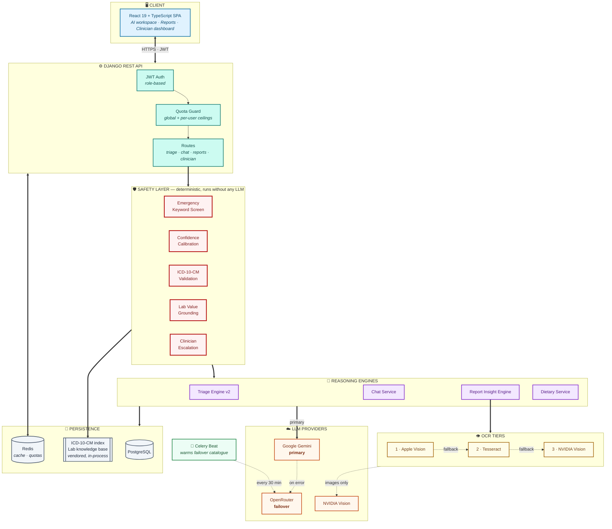

<div align="center">

# MedAid

**A safety-first AI triage platform that turns a patient's description of their symptoms into a structured, risk-stratified assessment a clinician can act on.**

Published at **IEEE ICTBIG 2025** · [Read the paper](https://ieeexplore.ieee.org/document/11323835) · [Cite](#citation)

</div>

> [!WARNING]
> **MedAid is a research prototype, not a medical device.** It has not been clinically validated or reviewed by any regulatory body. Its output is preliminary guidance only and never a substitute for professional diagnosis. In an emergency, contact your local emergency services.

---

## Demo

_Live demo and screenshots coming soon._ In the meantime, [Getting Started](#getting-started) has the app running locally in under five minutes.

---

## What Is This?

An LLM-driven triage agent for under-resourced healthcare settings, where the first triage decision is normally made by the patient with no information — they delay care that's needed, seek emergency care that isn't, and clinicians receive intake with no priority signal at all.

You describe your symptoms; MedAid:
1. screens the text for emergency keywords **before any model call**,
2. asks Google Gemini to produce a structured differential — conditions, confidence, reasoning, next steps,
3. **grounds** that output against deterministic checks — a confidence ceiling based on how much you actually said, condition names validated against ICD-10-CM, lab values classified by arithmetic rather than the model,
4. and escalates to a clinician automatically when the risk is high.

Because the grounding step runs on every response, a hallucinated condition or an overconfident number gets caught before a patient sees it, rather than trusted because it came from a model.

**The governing idea:** the LLM is the least trustworthy component in the system, so it is given the smallest possible amount of authority. Every safety check below still works with zero API keys configured.

---

## Key Features

| Feature | What it does |
|---|---|
| **Multi-stage triage** | Free-text symptoms → risk tier, ranked differential, reasoning, next steps, when-to-seek-care guidance |
| **Pre-LLM emergency screen** | Negation-aware keyword match runs before any model call and short-circuits straight to emergency routing |
| **Confidence calibration** | Self-reported model confidence is capped against how specific the patient's actual input was — "I feel bad" cannot score 90% |
| **ICD-10-CM validation** | Condition names checked against a curated list, then a vendored ICD-10-CM index, in-process, no network call |
| **Cross-provider failover** | Gemini primary, OpenRouter failover resolved from a pre-warmed free-model catalogue — adds no latency to a live request |
| **Deterministic lab grounding** | Reference ranges and normal/low/high/critical classification come from arithmetic against a knowledge base, never the LLM |
| **Clinician escalation** | High-risk assessments and critical lab values auto-create an alert and auto-assign the least-loaded clinician |
| **3-tier OCR** | Apple Vision (macOS) → Tesseract → NVIDIA vision, each tier logging which one served the request |
| **Chat workspace** | Conversational triage with clarifying questions, file attachments, voice input, per-turn assessment cards |
| **LLM quota guards** | Reserve-then-check counters with global and per-user ceilings on every LLM call site |

Also included: condition-aware dietary guidance, risk-weighted nearby-facility lookup with maps, PDF health-passport export, and a token-driven design system with a WCAG-AA risk palette in light and dark.

---

## Architecture


```mermaid
flowchart TB
    subgraph client["🖥️  CLIENT"]
        UI["React 19 + TypeScript SPA<br/><i>AI workspace · Reports · Clinician dashboard</i>"]
    end

    subgraph api["⚙️  DJANGO REST API"]
        direction TB
        AUTH["JWT Auth<br/><i>role-based</i>"]
        QUOTA["Quota Guard<br/><i>global + per-user ceilings</i>"]
        ROUTES["Routes<br/><i>triage · chat · reports · clinician</i>"]
        AUTH --> QUOTA --> ROUTES
    end

    subgraph safety["🛡️  SAFETY LAYER — deterministic, runs without any LLM"]
        direction LR
        EMERG["Emergency<br/>Keyword Screen"]
        CALIB["Confidence<br/>Calibration"]
        ICD["ICD-10-CM<br/>Validation"]
        LABS["Lab Value<br/>Grounding"]
        ALERTS["Clinician<br/>Escalation"]
    end

    subgraph engines["🧠  REASONING ENGINES"]
        direction TB
        TRIAGE["Triage Engine v2"]
        CHAT["Chat Service"]
        REPORT["Report Insight Engine"]
        DIET["Dietary Service"]
    end

    subgraph providers["☁️  LLM PROVIDERS"]
        direction LR
        GEM["Google Gemini<br/><b>primary</b>"]
        OR["OpenRouter<br/><b>failover</b>"]
        NV["NVIDIA Vision"]
    end

    subgraph ocr["👁️  OCR TIERS"]
        direction LR
        T1["1 · Apple Vision"]
        T2["2 · Tesseract"]
        T3["3 · NVIDIA Vision"]
        T1 -.fallback.-> T2 -.fallback.-> T3
    end

    subgraph data["💾  PERSISTENCE"]
        direction LR
        PG[("PostgreSQL")]
        RD[("Redis<br/><i>cache · quotas</i>")]
        KB[["ICD-10-CM index<br/>Lab knowledge base<br/><i>vendored, in-process</i>"]]
    end

    CEL["🔄 Celery Beat<br/><i>warms failover catalogue</i>"]

    UI <==>|"HTTPS · JWT"| api
    ROUTES ==> safety
    safety ==> engines
    engines ==>|"primary"| GEM
    GEM -.->|"on error"| OR
    REPORT ==> ocr
    ocr -.->|"images only"| NV
    engines ==> data
    safety ==> KB
    CEL -.->|"every 30 min"| OR
    api <==> RD

    classDef clientStyle fill:#e0f2fe,stroke:#0369a1,stroke-width:2px,color:#0c4a6e
    classDef apiStyle fill:#ccfbf1,stroke:#0f766e,stroke-width:2px,color:#134e4a
    classDef safetyStyle fill:#fef2f2,stroke:#b91c1c,stroke-width:3px,color:#7f1d1d
    classDef engineStyle fill:#f3e8ff,stroke:#7e22ce,stroke-width:2px,color:#581c87
    classDef providerStyle fill:#fff7ed,stroke:#c2410c,stroke-width:2px,color:#7c2d12
    classDef ocrStyle fill:#fefce8,stroke:#a16207,stroke-width:2px,color:#713f12
    classDef dataStyle fill:#f1f5f9,stroke:#475569,stroke-width:2px,color:#1e293b
    classDef workerStyle fill:#ecfdf5,stroke:#15803d,stroke-width:2px,color:#14532d

    class UI clientStyle
    class AUTH,QUOTA,ROUTES apiStyle
    class EMERG,CALIB,ICD,LABS,ALERTS safetyStyle
    class TRIAGE,CHAT,REPORT,DIET engineStyle
    class GEM,OR,NV providerStyle
    class T1,T2,T3 ocrStyle
    class PG,RD,KB dataStyle
    class CEL workerStyle
```

**The load-bearing idea:** the safety layer sits *between* the API and the reasoning engines, not after them. Every request passes through it on the way in and on the way out, and every check in it is deterministic — so the system's floor is set by code, not by whether a model responded.

**Safety control:** the emergency screen and the post-generation grounding (confidence cap, ICD-10 validation, risk floor) are pure code — no model in the loop — so they hold even during a full provider outage. A degraded response is floored at `medium` risk and flagged `requires_human_review`; it can never quietly present as `low`.

**Failover:** exactly one cross-provider attempt against OpenRouter, resolved from a catalogue a Celery beat job refreshes every 30 minutes — so discovering a fallback model costs no extra latency on the request path.

**Not a RAG pipeline.** Retrieval here is exact-match and arithmetic, not vector similarity: a lab reference range is a fact to look up, not a nearest neighbour to approximate. The [Lab-AI study](https://arxiv.org/abs/2409.18986) found unaugmented LLMs answer lab reference-range questions at 38.4% accuracy, rising to 99.3% when grounded in retrieved source data — so classification is arithmetic, and the model only ever writes prose about a value already verified.

---

## Safety & Guardrails

The part of the system that matters most, in the order a request passes through it:

1. **Emergency screen** — [`api/safety/emergency_check.py`](backend/api/safety/emergency_check.py), the single source of truth, called from every entry point (direct triage, chat, guided flow) so routing is identical no matter how a patient entered. Negation-aware: "no chest pain" does not fire the chest-pain rule.
2. **Input specificity gate** — sparse descriptions produce clarifying questions instead of a low-evidence guess, once per conversation.
3. **Confidence calibration** — the API returns both `reported_confidence` (the model's claim) and the calibrated `confidence`, plus `confidence_explanation`, so the UI can say *why* a result is uncertain rather than showing a bare number.
4. **Condition validation** — curated list, then ICD-10-CM. An unrecognised name is flagged, never silently dropped and never presented with the authority of a validated term.
5. **Risk floor** — model risk is raised to `high` if emergency keywords are present; a degraded response never falls below `medium`. The floor only ever moves up.
6. **Deterministic critical-value escalation** — a critically low lab value reaches a clinician on arithmetic classification, regardless of how the model's prose reads it.

**Honest limitation:** critical-value coverage is bounded by the knowledge base — an analyte with no reference data classifies as `unknown`, never `critical`. This raises the floor substantially; it is not a complete safety net.

---

## Tech Stack

| Layer | Technologies |
|---|---|
| **Frontend** | React 19 · TypeScript · Tailwind CSS · React Router · Framer Motion · Leaflet |
| **Backend** | Django 4.2 · Django REST Framework · SimpleJWT · Celery + beat · django-redis |
| **Database** | PostgreSQL (production) · SQLite (development) — selected by `DB_ENGINE`, no default |
| **AI/LLM** | Google Gemini (primary) · OpenRouter (cross-provider failover) · NVIDIA vision (report images) |
| **OCR** | Apple Vision (PyObjC sidecar) · Tesseract · PyMuPDF |
| **Medical data** | Vendored ICD-10-CM tabular list (CMS/NCHS, public domain) · lab reference knowledge base |
| **Infra** | Redis (cache, Celery broker, cross-worker quotas) · ReportLab · GitHub Actions |

---

## Getting Started

**Prerequisites:** Python 3.12+, Node 18+. PostgreSQL, Redis, and Tesseract are optional locally. You'll want a [Gemini API key](https://aistudio.google.com/) (free tier works) — every other feature degrades gracefully without one.

```bash
git clone https://github.com/janhvisaste/Medaid.git
cd Medaid

# Backend
python3 -m venv .venv && source .venv/bin/activate     # Windows: .venv\Scripts\activate
pip install -r backend/requirements.txt
cp backend/.env.example backend/.env                    # add your GOOGLE_API_KEY
cd backend && python manage.py migrate && python manage.py runserver 8001

# Frontend (new terminal)
cd frontend && cp .env.example .env.local
npm install --legacy-peer-deps && npm start
```

Frontend at **localhost:3000**, API at **127.0.0.1:8001/api**. Or run `./start-medaid.sh` (`.\start-medaid.ps1` on Windows) to start both at once.

Every variable — including which ones fail silently when unset — is documented in [`backend/.env.example`](backend/.env.example).

---

## How It Works

1. **Complete your profile** — pincode (prefills facility search) and medical history feed directly into the assessment prompt.
2. **Describe your symptoms** in the AI workspace, in plain language.
3. **Answer clarifying questions** if your description is too sparse to support a confident answer.
4. **Read the assessment card** — risk badge, calibrated confidence, leading condition, next steps, and (for high/emergency risk) a **Call 112** / **Find nearest facility** banner.
5. **Attach a report** — PDF or image — and it's OCR'd, lab values classified deterministically, findings explained alongside your message.
6. **Download the PDF** to hand to your doctor.

Clinicians get a separate dashboard: assigned patients, priority-ordered alerts, and private notes per case.

---

## API Reference

| Method | Path | Purpose |
|---|---|---|
| `POST` | `/api/auth/signup/`, `/api/auth/login/` | Register / authenticate (JWT) |
| `POST` | `/api/triage/assess/` | Run a full triage assessment |
| `GET` | `/api/triage/history/` | Assessment history |
| `GET` | `/api/models/available` | Allow-listed selectable models |
| `POST` | `/api/reports/analyze/` | OCR + structure an uploaded medical report |
| `POST` | `/api/chat/conversations/<id>/messages/` | Send a chat turn (multipart for attachments) |
| `GET` | `/api/facilities/nearby/` | Risk-weighted nearby-facility search |
| `GET` | `/api/recommendations/dietary/` | Condition-aware dietary advice |
| `GET` | `/api/reports/download/<triage_id>/` | Assessment PDF |
| `GET` | `/api/clinician/{stats,patients,alerts}/` | Clinician dashboard data |

<details>
<summary><b>Example — <code>POST /api/triage/assess/</code></b></summary>

```jsonc
// response (abridged)
{
  "risk_level": "low",
  "confidence": 0.42,                 // calibrated
  "reported_confidence": 0.85,        // what the model claimed
  "confidence_was_capped": true,
  "possible_conditions": [
    { "disease": "Post-Viral Cough", "confidence": 0.35 }
  ],
  "recommendations": ["Stay hydrated and use a humidifier at night"],
  "requires_human_review": false,
  "assessment_source": "ai_v2"
}
```

An emergency short-circuit returns `"assessment_source": "emergency_rule"` and never calls a model.

</details>

---

## Project Structure

```
backend/
├── manage.py · requirements.txt
├── medaid/                     settings · urls · celery
└── api/
    ├── models.py                13 models: users, triage, reports, clinician
    ├── views.py                 REST endpoints
    ├── triage_engine_v2.py      multi-stage assessment + provider failover
    ├── chat_service.py          conversational triage
    ├── report_processor.py      OCR → insight orchestration
    ├── safety/                  emergency_check · critical_findings · clinician_alerts
    ├── assessment_quality.py    confidence calibration + name validation
    ├── icd10.py, lab_reference.py   deterministic grounding
    ├── llm_providers/           gemini · openrouter · catalog
    └── test_*.py                33 modules, 343 tests

frontend/src/
├── styles/medaidTokens.ts       single source of design truth
├── services/                    apiService · authService
└── components/
    ├── Dashboard/                AI workspace (chat + assessments)
    ├── Results/                  AssessmentCard · DietaryAdvice
    └── Clinician/ Profile/ PatientHistory/ Reports/ Auth/ Layout/ ui/

ocr-service/                     Apple Vision OCR sidecar (macOS only)
```

---

## Testing

343 tests, every provider call mocked — the suite runs with **no API keys**, which also proves the degraded paths work without credentials.

```bash
cd backend && python manage.py test         # full suite
cd frontend && CI=true npm run build        # type-check + lint + build
```

Coverage concentrates on risk: `test_emergency_check`, `test_critical_findings`, `test_confidence_cap`, `test_icd10_validation`, `test_provider_fallback`, plus end-to-end flow tests. CI runs this suite, a missing-migration check, the frontend build, and a secret scan on every push — see [`.github/workflows/ci.yml`](.github/workflows/ci.yml).

---

## Deployment

Provision PostgreSQL, Redis, and object storage for `MEDIA_ROOT`, then:

```bash
python manage.py migrate --no-input && python manage.py collectstatic --no-input
gunicorn medaid.wsgi:application --bind 0.0.0.0:8000 --workers 4
celery -A medaid worker -l info          # plus: celery -A medaid beat -l info

cd frontend && npm ci --legacy-peer-deps && npm run build   # serve build/ from a CDN
```

Set `DJANGO_DEBUG=False` (flips SSL redirect, HSTS, and secure cookies to their hardened defaults), a real `DJANGO_SECRET_KEY`, `DB_ENGINE=postgresql`, `REDIS_URL`, `ALLOWED_HOSTS`, and `CORS_ALLOWED_ORIGINS`. The app is stateless and provider-agnostic — anything that runs a Django container works. The only macOS-bound piece is the Apple Vision OCR sidecar; on Linux that tier drops out and Tesseract serves.

---

## Known Limitations

Stated plainly, because a triage system that overstates itself is the failure mode that matters.

- **Not clinically validated** — no prospective study, no regulatory review.
- **Emergency detection is keyword-based** — negation-aware, but a patient using words the list doesn't contain falls through to the LLM path.
- **Critical-value coverage is bounded by the knowledge base** — an out-of-scope lab test never classifies as `critical`.
- **English only**, with a few transliterated Hindi terms in the keyword list.
- **OCR tier 1 is macOS-only** — Linux runs on Tesseract, measurably weaker on photographed reports.

---

## Roadmap

- Docker Compose for one-command full-stack startup
- OpenAPI schema + browsable Swagger UI
- Observability (Sentry, OpenTelemetry, metrics)
- Multilingual triage (Hindi, Marathi)
- Clinician feedback loop measured against calibration accuracy

---

## Contributing

See [CONTRIBUTING.md](CONTRIBUTING.md) for the workflow, code style, and branching model. The one hard rule: **anything touching the safety layer needs a test proving the guardrail holds when the LLM is unavailable.** Security issues go through [SECURITY.md](SECURITY.md), not public issues.

---

## Citation

Published research — cite the paper if you build on this work:

```bibtex
@inproceedings{kinagi2025medaid,
  title     = {Medaid: A Safety-First AI Triage System for Rural Healthcare},
  author    = {Kinagi, Shivani and Jain, Sayyam and Saste, Janhvi and
               Sakhare, Nitin and Yenkikar, Anuradha and Pandit, Pranjal and
               Sable, Nilesh},
  booktitle = {2025 IEEE 5th International Conference on ICT in Business
               Industry \& Government (ICTBIG)},
  year      = {2025}, publisher = {IEEE},
  doi       = {10.1109/ICTBIG68706.2025.11323835}
}
```

Also referenced: [Lab-AI (arXiv:2409.18986)](https://arxiv.org/abs/2409.18986), whose grounding results shaped the decision to keep lab classification out of the model.

---

## Contact & Support

- **Bugs and feature requests** — [open an issue](https://github.com/janhvisaste/Medaid/issues)
- **Security concerns** — see [SECURITY.md](SECURITY.md); please don't open a public issue
- **Everything else** — [@janhvisaste](https://github.com/janhvisaste)

---

<div align="center">

**Author:** Janhvi Saste — [@janhvisaste](https://github.com/janhvisaste)

Licensed under [MIT](LICENSE) · *the language model is the least trustworthy component, so give it the least authority.*

</div>
